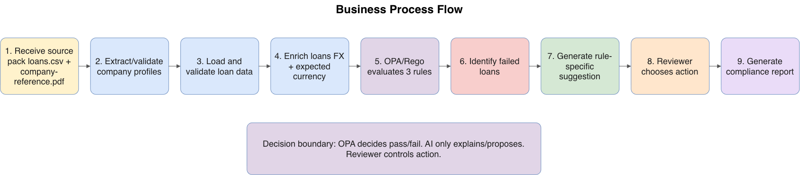
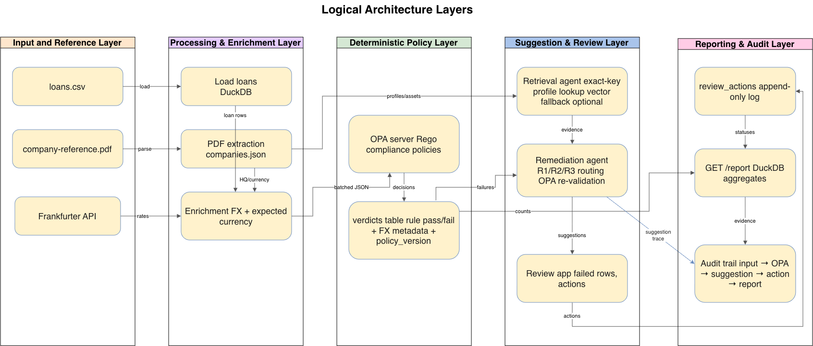
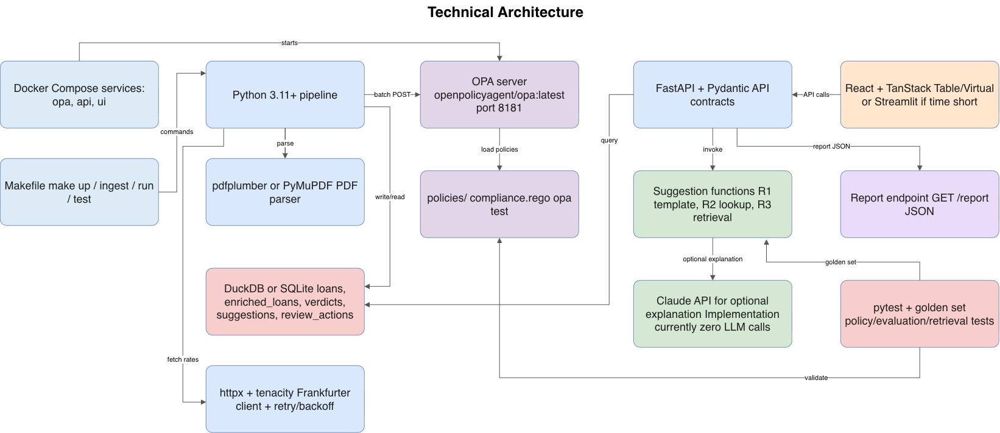
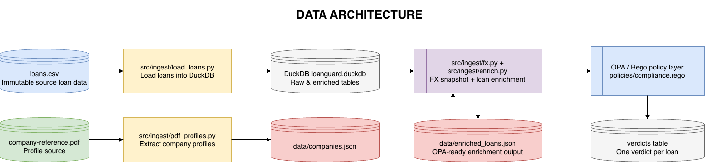
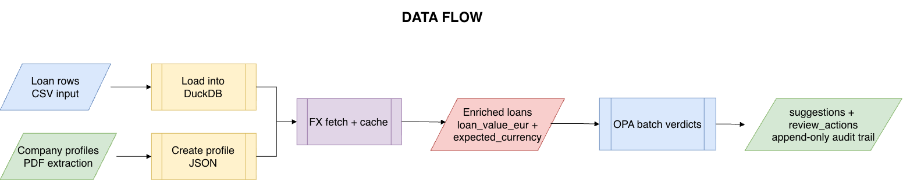
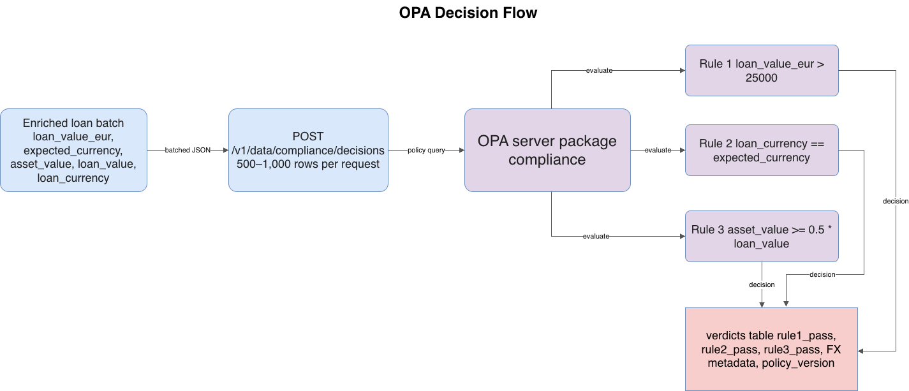
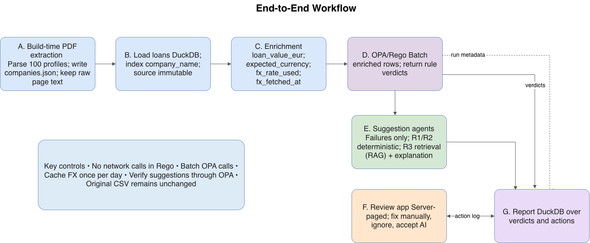

# LoanShield Loan Compliance Review System

# Technical Solution Design

Version: 2.0  
Date: 05-Aug-2026

## 1\. Executive Summary

LoanShield is an agentic compliance checking over OPA/Rego, with human-in-the-loop review. It automates pre-reporting compliance checks for pledged-asset loan records.

This document specifies the design of a system that checks 100,000 bank loans, across 100 companies, against three compliance rules; generates AI-assisted remediation suggestions for anything that fails; and routes every failure to a human reviewer who can fix it manually, ignore it, or accept the suggested fix. A compliance report summarizes results across the full dataset.

## 2\. Business Context

### 2.1 Problem Statement

A bank holds a portfolio of 100,000 loans across 100 companies, each secured against a pledged asset. Before these loans can be reported, each must pass three compliance checks: a minimum loan value in EUR, a currency that matches the borrower's home jurisdiction, and collateral coverage of at least 50% of the loan value. At this scale, manual checking is impractical, and any automated fix suggestion needs to be verifiably correct — not merely plausible — before a reviewer acts on it.

### 2.2 Business Need
A working system is needed, which can run against the full dataset, keep compliance verdicts deterministic and explainable, assist reviewers with remediation options, and produce a clear compliance and portfolio report.

### 2.2 Business Objectives
- Enforce three deterministic compliance rules across the entire loan portfolio, consistently and repeatably.
- Avoid model-based compliance judgements
- Give every failing loan a genuinely useful, explainable remediation suggestion rather than just a fail flag.
- Support human-in-the-loop who is in control of every change for remediation.
- Explain and trace decisions, suggestions, and review actions
- Produce a portfolio-level compliance report (per-rule failure counts, resolution status, loan value by company).
- Do all of the above at real scale (100,000 rows) without the tooling becoming unusable.

### 2.3 Success Criteria
- Every verdict is traceable to a specific, readable Rego policy — not a model's judgement call.
- Suggested fixes are genuinely usable: Rule 1 says remove the loan, Rule 2 proposes a currency backed by the lookup table, Rule 3 proposes a real alternative asset or honestly reports none exists.
- The review application stays usable at 100,000 rows.
- The report gives a clear, per-rule picture of findings and outcomes.
- Every design decision — especially the deterministic/probabilistic boundary — can be explained.

## 3\. As-Is State

- Loan and collateral data exists (loans.csv, company-reference.pdf) but is not evaluated against compliance rules by any existing tool described in the source documents.
- If compliance checking happens today, pre-reporting validation would be manual — no rule engine, review workflow, audit log, or report currently exists for this dataset.
- There is no existing integration with a live FX rate source, no existing country→currency reference table, and no existing retrieval mechanism over the company reference document.

## 4\. To-Be State

The target system extracts company profiles once at build time, loads and enriches loans per run, evaluates all three rules for every loan through OPA, generates and re-validates AI remediation suggestions for every failure, and exposes both a scalable review application and a compliance report.

## 5\. Scope

### 5.1 In Scope

- Build-time ingestion and validation of loans.csv (100,000 rows) with source immutability.
- Parse Company-reference.pdf (100 companies, 104 pages) into json with source page text.
- A static, version-controlled country→currency lookup table, cross-checked against currencies observed in the input data.
- Live FX rate retrieval (Frankfurter), one call per day covering all 8 currencies, cached with a bounded-staleness fallback.
- Three Rego policies evaluated by an OPA server: minimum loan value, currency-matches-HQ, asset coverage — batched.
- Generate rule-specific suggestions for failed loans only that supports remediation: fix-manually / ignore / accept-AI-fix, scalable to the full dataset via server-side paging and row virtualization.
- An append-only action log and a compliance report with total checked, per-rule failures, review status, company totals, and run metadata.

### 5.2 Out of Scope

- Using LLMs to determine compliance pass/fail.
- Network calls from Rego policies.
- Mutating the original loans.csv or raw loans table.
- Per-row FX calls.

## 6\. Requirements Catalogue

### 6.1 Business Requirements

| **ID** | **Business Requirement**                                                 | 
| ------ | ------------------------------------------------------------------------ | 
| BR-001 | Process the supplied loan portfolio for pre-reporting compliance checks. | 
| BR-002 | Ensure compliance verdicts are deterministic and explainable.            | 
| BR-003 | Support reviewer remediation for failed loans.                           | 
| BR-004 | Preserve evidence for decisions, suggestions, and actions.               | 
| BR-005 | Produce a compliance and portfolio summary report.                       | 

### 6.2 Functional Requirements

| **ID**      | **Functional Requirement**                                                                     | **Priority**|         
| ----------- | -----------------------------------------------------------------------------------------------|-----------|
| FR-001 | Extract all 100 company profiles from the 104-page reference PDF once at build time into a committed companies.json; fail the build if the count is not exactly 100.| Must|
| FR-002 | Load 100,000 loan rows into DB, indexed on company_name; never mutate the source data without mutating the source.                      | Must|
| FR-003 | Build a static country-currency table and validate it against observed PDF currencies.|Must|
| FR-004   | Fetch a EUR-base FX snapshot once per day and cache it.| Must|
| FR-005   | Mark the run degraded if fallback cache is used.| Must|
| FR-006  | Evaluate Rule 1 in OPA: loan value in EUR must exceed 25,000, converting non-EUR loans at the exchange rate on the day of the check (strict “more than” — exactly 25,000 fails).| Must|
| FR-007  | Evaluate Rule 2 in OPA: loan currency must equal the currency implied by the borrower's HQ country| Must|
| FR-008  | Evaluate Rule 3 in OPA: pledged asset value must be at least 50% of loan value, same currency (“at least” — exactly 50% passes).| Must|
| FR-009  | Rule 1 failures: agent returns a template message stating the EUR value, rate, and date, and recommends removing the loan from the report. No LLM call.| Must|
| FR-010  | Rule 2 failures: agent performs a deterministic lookup (HQ country → currency table) and proposes the correct currency, citing the source company profile. No LLM call. | Must|
| FR-011  | Rule 3 failures: agent retrieves the company's asset list and proposes the smallest asset that clears the 50% threshold, comparing in the company's home currency; if none qualifies, it says so explicitly.| Must|
| FR-012  | For every failing loan, the reviewer can see what failed and why, and choose: fix manually, ignore, or accept the AI fix. | Must|
| FR-013  | Generate a report: total checked, run timestamp and FX rate/fetch time used, failures per rule (not combined) plus a distinct “failed any” count, fixed/ignored/unresolved counts, total loan value per company.| Must|
| FR-014| All pass/fail verdicts are produced exclusively by OPA evaluating batched Rego policy — never by a model's judgement, and never via http.send inside Rego.| Must|
| FR-015| Retrieval for Rule 3 uses exact company-name key lookup as the primary path; a vector index over asset descriptions is an optional fallback for fuzzy matching only.| Must|
| FR-016| Every AI-suggested fix is re-run through OPA on a copy of the row before being surfaced; suggestions that still fail are withheld, not shown. | Must|
| FR-017| Suggestions are cached by (company, rule, loan value bucket), not by loan_id, since the answer does not depend on the individual loan. | Must|
| FR-018| The review application queries only failing rows (thousands, not 100,000), server-paged with a cursor, and renders with row virtualization. | Must|
| FR-019| The review UI supports filtering by rule, company, and status, sorting only on indexed columns.| Should|
| FR=020| A manual edit is re-validated through OPA via the same path as an accepted AI fix. | Must|
| FR-021| Every reviewer action is recorded in an append-only review_actions log (loan_id, action, payload, actor, timestamp); current state derives from the latest action per loan. | Must|
| FR-022| Report separately flags loans where a recorded action still fails OPA re-validation (still_failing).| Should|
| FR-023| Provide a regression-based asset-value predictor (HQ region, industry, loan value, asset type), grouped-CV by company, reporting out-of-sample RMSE in EUR.| Could|

### 6.3 Non-Functional Requirements

| **ID**        | **Category**  | **NFR**                                                | 
| ------------- | ------------- | ------------------------------------------------|
| NFR-001 | Scalability | System must handle the full 100,000-row dataset without loading all rows into memory or the DOM at once.|                     |
| NFR-002  | Performance | FX rate fetched once per day
| NFR-003 | Performance | OPA calls batched.|
| NFR-004    | Reliability| On FX failure, retry with backoff, then fall back to a cache younger than an explicitly chosen staleness threshold; beyond that, fail the run rather than guess.|
| NFR-005 | Determinism| Compliance verdicts must be reproducible; every verdict traces to a specific Rego policy version.|
| NFR-006 | Auditability| FX rate, timestamp, and degraded flag stored per verdict; reviewer actions kept in an append-only log for full audit trail.|
| NFR-007 | Explainability| Every component — Rego rule, agent prompt, design decision — must be explainable by any team member without deferring to “the AI wrote it.”|
| NFR-008 | Data Integrity| Raw loans table is immutable; all enrichment/derivation writes to separate tables; review actions never overwrite source rows.|
| NFR-009| Maintainability | Country→currency mapping is a hand-built, version-controlled table, cross-checked against the PDF — not a runtime LLM call.|

## 7\. Personas and Roles

| **Persona / Actor**       | **Role in solution**                                                           |
| ------------------------- | ---------------------------------------------------------------------------------------------- |
| Compliance Reviewer (Human)| Reviews failed loans and chooses to manually fix, ignore, or accept AI.                        |
| Pipeline Orchestrator     | Runs deterministic DAG: FX, enrichment, batch OPA, persist verdicts.                           |
| Profile Extraction Agent  | Build-time parser for company-reference.pdf to companies.json, validated (exactly 100 profiles, every asset has value + currency) |
| Retrieval Agent           | Given a company name, returns its profile, assets, and source page. Exact-key primary, vector fallback optional. Evaluated for recall (all 100 companies) and asset-selection precision. |
| Currency Resolution Agent | HQ country → expected currency via the static table. Deterministic, pure function, fully unit-tested.|
| Remediation Agent         | Routes a failure to the right generator (R1 template, R2 lookup, R3 retrieval and re-validates the proposal through OPA before it is shown.|
| OPA/Rego Policy Engine    | Only source of compliance pass/fail decisions.                                                 |
| Report Consumer (Human)   | Consumes compliance and portfolio summary report.                                              |

## 8\. Assumptions

For the purpose of the workshop the following is assumed:
- Single local deployment is sufficient; no multi-tenant or networked production use is implied.
- No authentication/authorization system is required for the assessment.
- loans.csv and company-reference.pdf are static for a given run; the FX rate is the only genuinely live external input.
- Live FX rate means “fetched once at the start of each pipeline run,” not continuous real-time streaming.

## 9\. Logical Architecture 

The logical view groups the system into the pipeline, deliberately separating the deterministic rule engine from the probabilistic suggestion agents so the boundary is visible in the architecture itself.

## 10\. Technical Architecture 

**10.1 Technical Stack**

| Layer | Recommendation | Rationale |
|---|---|---|
| Rule engine | **OPA server + Rego**, `opa test` | The server mode gives batch eval |
| Language | Python 3.11+ | Fastest path |
| Store | **DuckDB** | 100k rows, zero setup, real SQL for the report |
| Dataframes | pandas or **polars** | Prep and enrichment only, not serving |
| PDF parsing | **pdfplumber** or PyMuPDF | Text layer is clean; tables need a little care |
| FX | **Frankfurter** (`api.frankfurter.dev`) + httpx + tenacity | No key, ECB rates, one call returns all 8 |
| API | **FastAPI** + Pydantic | Typed contracts between pipeline, OPA and UI |
| Agent layer | Plain Python functions calling the Claude API | Unexplainable framework is a liability |
| Vector (optional) | sentence-transformers + FAISS or Chroma | ~350 assets — tiny; only for fuzzy fallback |
| Frontend | **React + TanStack Table/Virtual**, or Streamlit  | Streamlit is faster to build but harder to keep smooth at scale — an honest trade-off to state, not hide |
| Testing | pytest + `opa test` + a hand-labelled golden set of ~50 rows | Evidence that the rules are right |
| Ops | Docker Compose (OPA + API + UI), Makefile | Starts in one command |

## 11\. Data Architecture 

Data flows one-way through immutable stages: raw loans are never modified; enrichment, verdicts, suggestions, and reviewer actions are each held in their own table.

|Entity| Key Fields| Produced By| Comments|
|Company |company_id, company_name, hq_country, industry, assets[{name,value,currency}], related_entities| Profile Extraction Agent (Stage A)| Exactly 100 records, committed as companies.json; raw page text retained for citation.|
|Loan (raw)	loan_id, company_name, hq_country, asset_description, asset_value, asset_owner, loan_value, loan_currency| Load Loans (Stage B)| 100,000 rows in DuckDB; immutable thereafter.|
|EnrichedLoan| + loan_value_eur, expected_currency, fx_rate_used, fx_fetched_at| Enrichment (Stage C) |Four derived fields; raw loans table untouched.|
|Verdict| loan_id, rule1_pass, rule2_pass, rule3_pass, fx metadata, policy_version| OPA decisions (Stage D)| One row per loan per day; produced from batched POSTs of 500–1,000 rows.|
|Suggestion| company_id + rule + loan_value_bucket key, proposed fix, re-validation result| Remediation Agent (Stage E)| Cached by bucket, not loan_id — with 100 companies and ≤4 assets each, very few distinct answers exist.|
ReviewAction| id, loan_id, action, payload, actor, created_at| Review Application (Stage F)| Append-only; current state = latest action per loan.|

### 11.1 Data Model Inventory

| **Entity / Store**        | **Explicit or inferred**                                   | **Purpose**                            | **Key fields**                                                                                             |
| ------------------------- | ---------------------------------------------------------- | -------------------------------------- | ---------------------------------------------------------------------------------------------------------- |
| loans table               | Explicit                                                   | Immutable source record store.         | loan_id, company_name, hq_country, asset_description, asset_value, asset_owner, loan_value, loan_currency. |
| companies.json / profiles | Explicit                                                   | Structured reference from PDF.         | company_id, company_name, hq_country, industry, assets, related_entities, source_page, raw_text.           |
| Asset records             | Explicit inside profile; table is inferred for ERD clarity | Assets that can be pledged by company. | name, value, currency, company_id.                                                                         |
| fx_cache.json             | Explicit                                                   | Last good EUR-base FX snapshot.        | rates, fetched_at, degraded/staleness metadata.                                                            |
| enriched_loans            | Explicit                                                   | OPA-ready enriched loan data.          | loan_value_eur, expected_currency, fx_rate_used, fx_fetched_at.                                            |
| verdicts                  | Explicit                                                   | OPA decision persistence.              | loan_id, rule1_pass, rule2_pass, rule3_pass, FX metadata, policy_version.                                  |
| suggestions               | Explicit                                                   | Persisted remediation suggestions.     | loan_id, rule, suggestion, evidence, revalidation_result.                                                  |
| review_actions            | Explicit                                                   | Append-only action audit log.          | id, loan_id, action, payload, actor, created_at.                                                           |
| report output             | Explicit                                                   | GET /report response.                  | total_checked, rule failures, failed_any, review_status, per_company, run.                                 |

### 11.2 API and Integration Inventory

| **Interface**                                  | **Direction**            | **Purpose**                                              | **Notes**                                        |
| ---------------------------------------------- | ------------------------ | -------------------------------------------------------- | ------------------------------------------------ |
| Frankfurter /v1/latest?base=EUR                | Pipeline to external API | Fetch EUR-base FX snapshot once per day.                 | Fallback to fresh cache; stale cache hard-fails. |
| OPA /v1/data/compliance/decisions              | Pipeline/API to OPA      | Evaluate enriched loan batches and re-validation copies. | 500-1,000 rows per evaluation batch.             |
| GET /failures?rule=&company=&cursor=&limit=100 | UI to API                | Retrieve server-paged failed rows.                       | No unbounded result sets.                        |
| GET /loans/{id}/suggestion                     | UI to API                | Retrieve generated or cached suggestion.                 | Lazy suggestions for visible rows.               |
| POST /loans/{id}/action                        | UI to API                | Write manual_fix, ignore, or accept_ai action.           | Append-only review action.                       |
| GET /report                                    | UI/consumer to API       | Return compliance report JSON.                           | SQL over verdicts and review_actions.            |

## 12\. OPA/Rego Policy Architecture

- One OPA server runs as a service using openpolicyagent/opa:latest and loads policies from the policies/ volume.
- One package, compliance, contains the decision entrypoint.
- The pipeline computes all external/derived fields before OPA evaluation.
- Rego does not make network calls.
- Rule thresholds live in policy or OPA data, not scattered across Python.
- Boundary tests cover exactly EUR 25,000, exact 50% coverage, and equal currencies.

| **Rule**                             | **OPA input**                    | **Policy condition**                          | **Boundary**           |
| ------------------------------------ | -------------------------------- | --------------------------------------------- | ---------------------- |
| Rule 1 - Minimum loan value          | loan_value_eur                   | Pass when loan_value_eur > 25000.             | 25000 exactly fails.   |
| Rule 2 - Currency matches HQ country | loan_currency, expected_currency | Pass when loan_currency == expected_currency. | Equal currencies pass. |
| Rule 3 - Asset coverage              | asset_value, loan_value          | Pass when asset_value >= 0.5 \* loan_value.   | Exactly 50% passes.    |

## 13\. Suggestion-Agent and RAG Architecture

Suggestion generation runs on failures only, never the full 100,000 rows. Rule 1 and Rule 2 do not require an LLM. Rule 3 uses retrieval over company profiles and deterministic asset filtering; LLM use is only for explanation wording, not compliance decisions or asset selection.

| **Rule** | **Suggestion mechanism**                                                                               | **LLM required?**                                  | **Validation**                                               |
| -------- | ------------------------------------------------------------------------------------------------------ | -------------------------------------------------- | ------------------------------------------------------------ |
| Rule 1   | Template: remove from report; include EUR value, rate, date where available.                           | No                                                 | No data correction; action is removal/exclusion guidance.    |
| Rule 2   | Deterministic lookup from PDF HQ country to country-currency table.                                    | No                                                 | Suggested currency is table-derived.                         |
| Rule 3   | Retrieve company profile; filter assets clearing 50%; choose smallest qualifying asset or return none. | Yes for explanation only; selection deterministic. | Apply suggested fix to a copy and re-run OPA before showing. |

## 14\. Process & Sequence Design

The most important design boundary in the whole system is which component decides what. The diagram below traces a single enriched loan row through both the deterministic rule engine and the probabilistic remediation path, including the two design subtleties WORKFLOW.md flags explicitly: selecting the smallest qualifying asset for Rule 3, and comparing in the company's home currency when Rule 2 and Rule 3 co-occur.

Figure 3 — Deterministic rule evaluation vs. probabilistic remediation, with re-validation as the closing loop.

- OPA evaluates all three rules for every row in a single batched decision; a pass on all three needs no further action.
- A failure on any rule routes to the rule-specific generator — never a generic “fix this” prompt over the raw row.
- Rule 3's selection policy is deliberate: among qualifying assets, propose the smallest one that clears the threshold (least over-collateralization), not the largest or the closest in type — a choice the team should be ready to defend.
- When a Rule 3 failure co-occurs with a Rule 2 failure, the loan's currency and the PDF asset's currency can differ; the design compares in the company's home currency, treating the Rule 2 fix as already applied.
- Every generated fix is replayed through OPA on a copy of the row before it is shown to anyone; suggestions that still fail are withheld, not surfaced as no_qualifying_asset only when genuinely none exist.
- The reviewer's decision (manual fix, ignore, accept AI fix) is the only thing ever written to the append-only action log — the agent's proposal alone changes nothing.

## 15\. API / Interface Design

| Method| Path| Purpose|
|-------|-----|--------|
|GET| /failures?rule=&company=&status=&cursor=&limit=50–100| Server-side paged, filterable list of failing loans; sorts only on indexed columns.|
|GET| /loans/{id}/suggestion| Retrieve the generated or cached AI suggestion for a loan (generated lazily if not cached).|
|POST| /loans/{id}/action| Record a reviewer decision — body: { action, payload } where action ∈ {manual_fix, ignore, accept_ai}.|
|GET| /report| Aggregated compliance report.|

## 16\. Error Handling & Resilience

| Scenario| Behaviour|
|---------|----------|
| FX API call fails| Retry with backoff (tenacity); fall back to the last cached snapshot if within the chosen staleness threshold; the run is marked degraded=true.|
| FX cache missing, malformed, or older than the staleness threshold| The run fails loudly rather than guessing a rate.|
|AI-suggested fix does not pass OPA on re-validation| The suggestion is withheld, not surfaced; Rule 3 rows with no qualifying asset are explicitly reported as such rather than forced.|
|A manual or accepted-AI fix still fails OPA afterwards| Reported to the reviewer as still failing (still_failing in the report), never silently accepted.|
|PDF parsing produces other than exactly 100 profiles, or an asset with a non-numeric value / missing currency| Build/ingest fails hard at Stage A, not discovered downstream.|
|Company name in CSV doesn't resolve to a PDF profile| Fails ingestion validation — verified ground truth shows this does not occur in the supplied data, but the check remains a build gate.|

## 17\. Reporting Design

The report is computed entirely from persisted tables (verdicts, review_actions) via straight SQL — it never re-derives compliance state from raw loans, so every field is traceable to a query or stored run metadata.
- Total loans checked; run timestamp; FX rate and fetch time used, with the degraded flag.
- Failures broken down per rule (Rule 1 / 2 / 3 separately), plus a distinct “failed any” count — a row can fail more than one rule, so this is explicitly not the sum of the three.
- Resolution status: fixed manually vs. fixed via AI suggestion vs. ignored vs. unresolved, plus a still_failing flag for actions that didn't actually clear OPA.
- Total loan value per company — doubling as a simple portfolio summary alongside the compliance results.

## 18\. Auditability, Governance, Security, and Observability

| **Control area**    | **Documented design control**                                                                          |
| ------------------- | ------------------------------------------------------------------------------------------------------ |
| Decision governance | Only OPA/Rego produces pass/fail verdicts.                                                             |
| AI boundary         | Agents explain/propose; no suggestion can change a verdict.                                            |
| Data integrity      | Raw CSV/source loans are immutable; review writes to separate action table.                            |
| Traceability        | Store FX metadata, policy_version, OPA verdicts, raw profile source page, suggestions, review actions. |
| Resilience          | FX cache fallback with degraded flag; stale fallback hard-fails.                                       |
| Performance         | Batch OPA; server-side pagination; virtualised rows; lazy suggestions; caching.                        |
| Observability       | Run metadata, cache hit rate, OPA revalidation count, degraded status, report reconciliation.          |

## 19\. Testing and Validation Strategy

| **Test area**         | **Validation required**                                                                                  |
| --------------------- | -------------------------------------------------------------------------------------------------------- |
| PDF extraction        | Exactly 100 profiles; values and currencies valid; every CSV company resolves.                           |
| Currency table        | Hand-built table agrees with observed PDF asset currencies.                                              |
| FX handling           | One HTTP call per day; fallback to fresh cache; stale cache fails; EUR-base conversion direction tested. |
| OPA policies          | OPA test boundary cases for Rule 1, Rule 2, Rule 3.                                                      |
| Full evaluation       | 100k evaluation in 1,000-row batches; verdict metadata persisted.                                        |
| Rule 3 retrieval      | Qualifying, exact-boundary, and no-asset cases; 50-row golden set.                                       |
| Suggestion validation | 100% actionable suggestions pass OPA re-validation before display.                                       |
| Review workflow       | All three actions work; still-failing status reported after failed re-check.                             |
| Reporting             | Report reconciles against independent SQL and raw CSV.                                                   |

### 19.1 Test Cases

| **Requirement / rule**                            | **Policy / component**                        | **Suggestion behavior**                                       | **Review / report evidence**                                   |
| ------------------------------------------------- | --------------------------------------------- | ------------------------------------------------------------- | -------------------------------------------------------------- |
| Rule 1: loan value > EUR 25,000                   | Rego Rule 1 using loan_value_eur.             | Remove from report template.                                  | Rule 1 failure count; fixed/ignored/unresolved status.         |
| Rule 2: loan currency matches HQ country currency | Rego Rule 2 using expected_currency.          | Suggest table-derived expected currency.                      | Rule 2 failure count; accepted/manual action status.           |
| Rule 3: asset covers at least 50%                 | Rego Rule 3 using asset_value and loan_value. | Retrieve assets; suggest smallest qualifying asset or none.   | Rule 3 failure count; no_qualifying_asset and action outcomes. |
| Human review actions                              | Review API and append-only log.               | Accept AI fix may apply suggestion; manual fix edits payload. | review_actions; review_status; still_failing.                  |
| FX dependency                                     | Pipeline enrichment and fx_cache.json.        | Rule 1 explanation can include rate/date.                     | Run metadata: FX rates, fetched time, degraded flag.           |
| Reporting                                         | SQL over verdicts and review_actions.         | N/A                                                           | GET /report JSON.                                              |

## 20\. RAID 

| **Type**   | **Item**                                          | **Mitigation / control**                                                        |
| ---------- | ------------------------------------------------- | ------------------------------------------------------------------------------- |
| Risk       | FX API unavailable when a run needs a rate or stale cache.| Retry/backoff; fallback only to fresh cache; degraded flag; hard fail if stale. |
| Risk       | Rendering or querying too much data in review UI. | Query failures only; cursor pagination; virtualised rows; indexed filters.      |
| Risk       | Borderline loans flip pass/fail as FX rates move day to day.| fx_rate_used and fx_fetched_at stored per verdict so any borderline result is reproducible and explainable.                              |
| Risk       | Rule 3 suggestion proposes invalid asset.         | Deterministic filtering and OPA re-validation before display.                   |
| Risk       | PDF layout changes break company profile parsing. | Hard validation gate (exactly 100 profiles; asset-currency cross-check against HQ country) fails the build loudly.|
| Risk       | Review UI degrades at 100,000 rows.| Server-side cursor paging and DOM virtualization designed in from Stage A/B, not retrofitted.|
| Assumption | CSV company names resolve to PDF profiles.        | Validated against all 100 companies.                                            |
| Assumption | PDF text layer is parseable without OCR.          | WORKFLOW.md states real text layer; use parser not OCR.                         |
| Dependency | OPA server/runtime.                               | Docker Compose service.                                                         |
| Dependency | Frankfurter or equivalent FX source.              | External rate source and cache.                                                 |
| Dependency | DuckDB local store.                        | Zero-setup SQL storage for PoC.                                              |

## 21\. Appendix A - Glossary

|Term| Meaning|
|-----|--------|
|OPA| Open Policy Agent — a general-purpose policy engine that evaluates Rego policies and returns decisions over JSON input.|
|Rego| The declarative policy language used to write OPA rules.|
|RAG| Retrieval-Augmented Generation — looking up a company's real asset list before generating a Rule 3 suggestion.|
|FX| Foreign exchange — the live currency conversion rate used for Rule 1.|
|DuckDB| An embedded analytical (OLAP) database used as the system's primary data store.|
|Golden set| A small, hand-labeled set of cases (here, ~50 Rule 3 failures) used to score retrieval/suggestion quality objectively.|
|Recall / precision (retrieval)| Recall: whether the right company profile is found at all (target: 100% via exact key). Precision: whether the asset selected within that profile is the correct one.|
|Degraded run| A run where the FX rate came from cache rather than a live call, flagged explicitly in the report.|
|Exact-key vs. vector retrieval| Exact-key: direct lookup by matching company name string. Vector: semantic/embedding-based similarity search, used only as a fallback here.|

